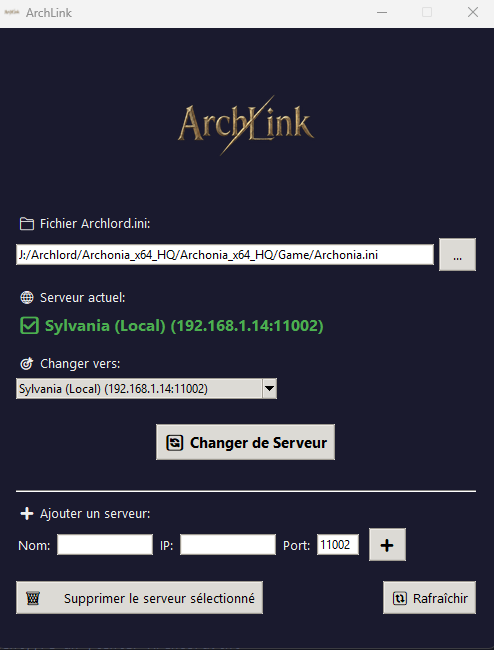

# ArchLink

## 🎮 Description

**ArchLink** est un outil de changement de serveur pour Archlord. Il permet de modifier facilement le fichier `Archlord.ini` chiffré pour basculer entre différents serveurs privés.

## ✨ Fonctionnalités

- 🔐 **Déchiffrement/Chiffrement automatique** du fichier `Archlord.ini` (RC4)
- 🔄 **Changement de serveur** en un clic
- ➕ **Ajout de serveurs** personnalisés (Nom, IP, Port)
- 🗑️ **Suppression de serveurs** de la liste
- 💾 **Sauvegarde automatique** de la configuration
- 🎨 **Interface moderne** avec thème sombre

## 📦 Contenu du package

| Fichier | Description |
|---------|-------------|
| `ArchLink.exe` | Application principale |
| `icon.ico` | Icône de l'application |
| `archlink_logo.png` | Logo affiché dans l'interface |
| `server_switcher_config.json` | Configuration des serveurs |

## 🚀 Installation

1. Extraire le contenu du ZIP dans un dossier
2. Lancer `ArchLink.exe`
3. **Aucune installation de Python requise !**

## 📖 Utilisation

1. Cliquer sur `...` pour sélectionner votre fichier `Archlord.ini`
2. Le serveur actuel s'affiche automatiquement
3. Sélectionner un serveur dans la liste déroulante
4. Cliquer sur **"Changer de Serveur"**

### Ajouter un nouveau serveur

1. Remplir les champs **Nom**, **IP** et **Port**
2. Cliquer sur le bouton **➕**

### Supprimer un serveur

1. Sélectionner le serveur dans la liste
2. Cliquer sur **"Supprimer le serveur sélectionné"**

## ⚙️ Configuration requise

- Windows 64-bit (Windows 10/11)
- Client Archlord installé

## 📜 Licence

Ce logiciel est distribué sous licence **MIT**. Voir le fichier `LICENSE` pour plus de détails.

---

**Créé par BlaMacfly** 🎮
